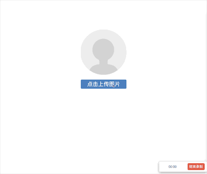
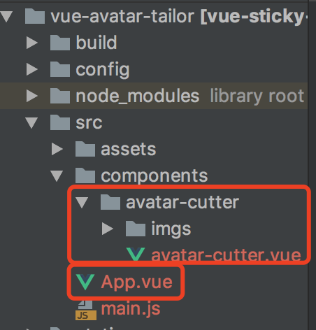

# vue-avatar-tailor组件
vue，头像裁剪组件，可对上传的图片用九宫格进行简单的裁剪




# 示例运行步骤
- 【下载依赖】npm install
- 【运行项目】npm run dev
- 【打开对应链接】浏览器打开对应链接
- 【设置top值示例】http://127.0.0.1:8080/#/


# 源代码
- /src/App.vue是使用头像裁剪组件的代码实例
- 组件源代码为/src/components/avatar-cutter/avatar-cutter.vue，拷贝整个/src/components/avatar-cutter文件夹使用即可

  


# 使用方法如下
  ```
  <avatar-cutter
    v-if="showCutter"
    return-type="url" // uploadAvatar回调函数返回的数据类型，'url'返回图片链接，'file'返回封装好的文件数据
    @cancel="showCutter = false"
    @enter="uploadAvatar" // 裁剪完成后的回调函数
  >
  </avatar-cutter>
  ```


# 组件原理及详细介绍，请移步[这个文章](https://segmentfault.com/a/1190000016587833)
